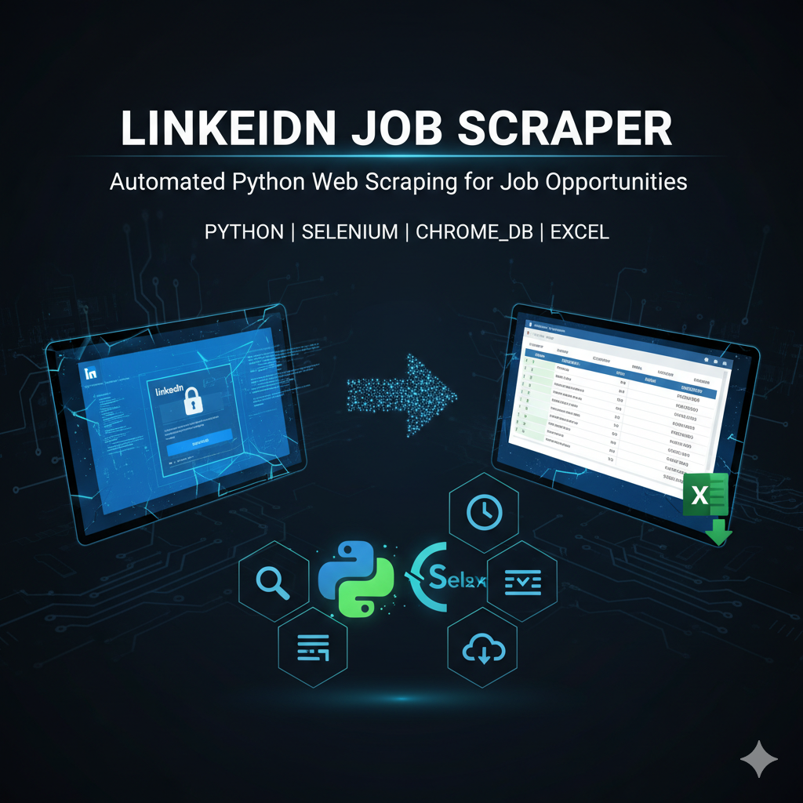

# LinkedIn-Job-Scraper

  

## 🧾 About the Project
The **LinkedIn Job Scraper** is an automated Python-based tool designed to simplify and speed up the job search process by extracting job-related data directly from LinkedIn posts.

Manually browsing LinkedIn for job posts can be time-consuming and repetitive — often missing important details hidden under long “see more” sections.  
This project solves that by **automating the entire process** — from logging in, searching for specific keywords, applying date filters, expanding post content, to collecting job-related information in a structured Excel file.

### 🎯 Purpose
The main goal of this project is to help:
- **Job Seekers** — collect and analyze recent job posts from target companies between specific date ranges.
- **Recruiters** — fetch company or candidate posts efficiently.
- **Data Analysts/Researchers** — study job market trends, posting frequency, and hiring patterns on LinkedIn.

---

### ⚙️ How It Works

1. **Automated Login:**  
   The script launches Chrome via **Selenium WebDriver** and opens the LinkedIn login page.  
   You manually log in to keep your credentials secure.

2. **Keyword & Date-Based Search:**  
   Once logged in, the scraper searches for posts related to a specific **keyword** (e.g., “TCS”, “Infosys”, “Data Scientist”) and applies a **date filter** to only fetch posts between the **start date** and **end date** you specify in the code.

3. **Scrolling & Dynamic Loading:**  
   It automatically scrolls through the posts feed for a certain duration, continuously loading new posts to ensure comprehensive scraping.

4. **Expanding “See More” Sections:**  
   Many job posts hide complete descriptions behind “see more”.  
   The scraper expands these sections to ensure **full details** are extracted.

5. **Data Extraction:**  
   It captures:
   - Company name  
   - Recruiter/Poster name  
   - Email address (if available)  
   - Full job description  
   - Date of posting  

6. **Data Export:**  
   After reaching the scrolling or time limit, the data is neatly organized and saved in an **Excel (.xlsx)** file.

⚙️ Installation Guide:
1️⃣Clone the Repository :- git clone https://github.com/<your-username>/linkedin-job-scraper.git

2️⃣ Install Dependencies:-pip install selenium pandas openpyxl

3️⃣ Set Up Chrome WebDriver

Download the correct version for your Chrome browser:
👉 https://chromedriver.chromium.org/downloads

Place chromedriver.exe in your project folder or set its path in your environment variables.

Run the Script :- python linkedin_scraper.py

Language: Python

Libraries Used:

selenium — Browser automation

pandas — Data manipulation and export

openpyxl — Excel file creation

datetime — Date filtering and handling

time — Delay management

Browser Driver: Chrome WebDriver (chrome_db)

Platform: LinkedIn

📦 Why This Project is Useful

Automates the LinkedIn job search process.

Filters job posts within a specific date range for precise data collection.

Expands hidden “see more” sections to capture full post content.

Outputs all data into a clean Excel sheet.

Ideal for market research, recruiter tracking, and job monitoring.

🔐 Security Note

This project does not store or auto-fill your credentials.
You log in manually through a secure browser window, ensuring your LinkedIn data stays private.

🌍 Real-World Applications

Automated job data collection and lead generation.

Market trend analysis based on date-filtered LinkedIn posts.

Research datasets for job market analytics.

Monitoring competitor hiring patterns.

🚀 Features

✅ Automated LinkedIn login

✅ Keyword-based search

✅ Date-based filtering between user-defined start and end dates

✅ Automatic scrolling for dynamic post loading

✅ Expands hidden “see more” content

✅ Data export to Excel (.xlsx)

✅ Extracts company, recruiter, email, job description, and post date

⚠️ Usage Notes

Ensure a stable internet connection.

Avoid running excessive scroll durations to prevent account restrictions.

Adjust the scroll time and date range for best performance.

LinkedIn’s UI updates may require script modifications over time.

🌱 Future Enhancements

Automate login using secure token-based authentication.

Add filters for job title, location, and company type.

Store data in SQL databases for large-scale analytics.

Build an interactive dashboard (e.g., Streamlit or Power BI).

Add email automation for alerts on new job posts.

📁 Project Structure:

  

⭐ Support

If you find this project helpful, please star ⭐ the repository and share it with others to support its development.
